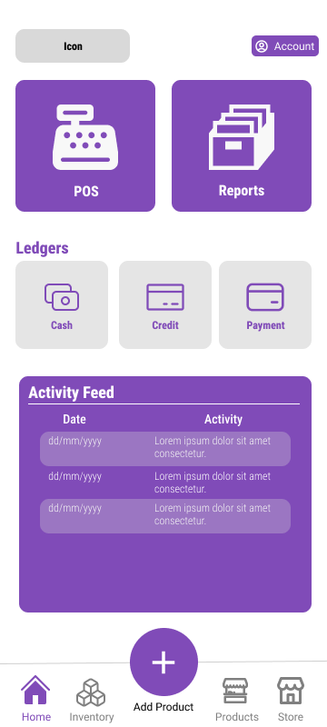

## Site Map

- ### Login and Signup

  * [Log in](LogIn.md)
  * [Sign up](SignUp.md)

- ### Main Page

  * [**Homepage**](#homepage-mock-up)
  * [Reports](Reports.md)
  * [Store](Store.md)

- ### Storage

  - #### Inventory System

    * [Interface](Inventory.md)
    * [Add Inventory Item]()
    * [Delete Inventory Item]()
    * [Edit Inventory Item]()

  - #### Product Storage System

    * [Interface](Products.md)
    * [Add Product]()
    * [Delete Product]()
    * [Edit Product]()

- ### Point-Of-Sales System

  * [POS Interface](PointOfSales.md)
  * [Add POS Item]()
  * [Delete POS Item]()
  * [Edit POS Item]()

- ### Ledgers

  * #### Cash Ledger

    * [Interface](CashLedger.md)
    * [Add Cash Record]()
    * [Delete Cash Record]()
    * [Edit Cash Record]()

  * #### Credit Ledger

    * [Interface](CreditLedger.md)
    * [Add Credit Record]()
    * [Delete Credit Record]()
    * [Edit Credit Record]()
  
  * #### Payment Ledger

    * [Interface](PaymentLedger.md)
    * [Add Payment Record]()
    * [Delete Payment Record]()
    * [Edit Payment Record]()

---

---

## Homepage Mock-Up

---

## Description
The **Homepage** houses all of the application's features. It contains the main functions: **POS**, **Reports**, **Ledgers**, with an additional **Activity Feed**. The footer of the homepage contains the main navigation footer. A **hero button** at the bottom-center of the homepage is added to create a **hotkey** or a means of quick access to the most frequent event used. This hotkey can be customized.

### Input
*None*

### Process
*None*

### Output
*None*

## Data Dictionary
| Element ID | Element Text | Element Type | Data Type | Required? | Rules |
|---|---|---|---|---|---|
|SystemIcon||Icon|Image|No|None|
|AccountInfo|Account|Button|Component|No|None|
|POSSytem|POS|Button|Component|No|None|
|Reports|Reports|Button|Component|No|None|
|LedgersHeader|Ledgers|Text|Text|No|Bolded|
|CashLedger|Cash|Button|Component|No|None|
|CreditLedger|Credit|Button|Component|No|None|
|PaymentLedger|Payment|Button|Component|No|None|
|ActivityFeedHeader|Activity Feed|Label|Text|No|Semi-bolded|
|ActivityFeedContents|...|Text|Text|No|Formatted
|HomepageIcon|Home|Icon|Image|No|None|
|InventoryIcon|Inventory|Icon|Image|No|None|
|HotkeyButton|+|Icon|Text|No|Magnified|
|ProductsIcon|Products|Icon|Image|No|None|
|StoreIcon|Store|Icon|Image|No|None|