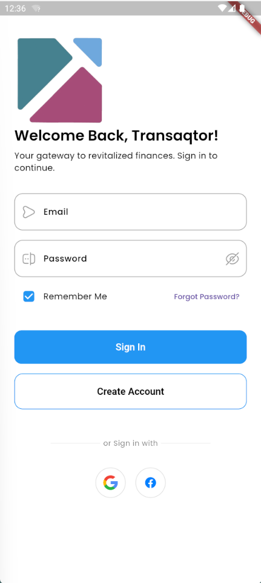

## Site Map

- ### Login and Signup

  * [**Log in**](#login-page-mock-up)
  * [Sign up](SignUp.md)

- ### Main Page

  * [Homepage](Homepage.md)
  * [Reports](Reports.md)
  * [Store](Store.md)

- ### Storage

  - #### Inventory System

    * [Interface](Inventory.md)
    * [Add Inventory Item]()
    * [Delete Inventory Item]()
    * [Edit Inventory Item]()

  - #### Product Storage System

    * [Interface](Products.md)
    * [Add Product]()
    * [Delete Product]()
    * [Edit Product]()

- ### Point-Of-Sales System

  * [POS Interface](PointOfSales.md)
  * [Add POS Item]()
  * [Delete POS Item]()
  * [Edit POS Item]()

- ### Ledgers

  * #### Cash Ledger

    * [Interface](CashLedger.md)
    * [Add Cash Record]()
    * [Delete Cash Record]()
    * [Edit Cash Record]()

  * #### Credit Ledger

    * [Interface](CreditLedger.md)
    * [Add Credit Record]()
    * [Delete Credit Record]()
    * [Edit Credit Record]()
  
  * #### Payment Ledger

    * [Interface](PaymentLedger.md)
    * [Add Payment Record]()
    * [Delete Payment Record]()
    * [Edit Payment Record]()

---

# Login Page Mock-Up

## Description
The **Login Page** features a simple user-interface that has both availability for email input and mobile number input. The user may opt to sign in with third-party authenticators such as **Facebook** and **Google**.

### Input

* **Email Address** - The email address of the user that wants to login.
* **Mobile Number** - The mobile number of the user. It will automatically prepend a country code to avoid ambiguity.
* **Password** - A unique string that allows access to a specific user.

### Process

* The system will check for input validity.
* Once valid, the system will lookup the credentials entered.

### Output

Access is granted for the user that has accepted credential inputs.

## Data Dictionary

| Element ID | Element Text | Element Type | Data Type | Required? | Rules |
|---|---|---|---|---|---|
|LoginHeader|Login|Header|Text|No|None
|LoginUsername|Email or Mobile Number|Text|Text|Yes|Must be valid email or mobile number
|LoginPassword|Password|Password|Text|Yes|Masked|
|LoginInvalidUsername|Invalid username and password|Text|Text|No|Hidden
|LoginForgotPassword|Reset Password|Link|Anchor|No|Hyperlink|
|LoginSignUp|Create an account here|Link|Anchor|No|Hyperlink|
|LoginButton|Log in|Button|Component|No|None|
|LoginWithGoogle|Continue with Google|Button|Component|No|Hyperlink|
|LoginWithFacebook|Continue with Facebook|Button|Component|No|Hyperlink|