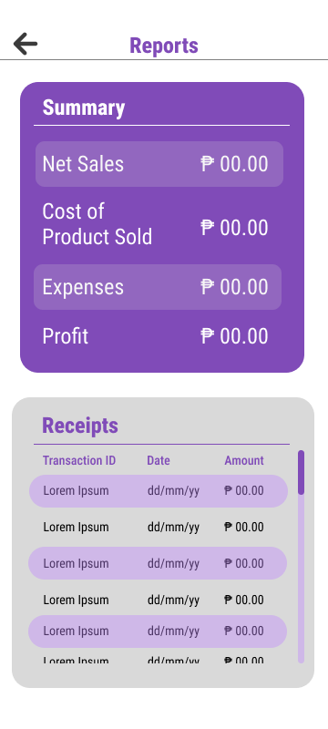

## Site Map

- ### Login and Signup

  * [Log in](LogIn.md)
  * [Sign up](SignUp.md)

- ### Main Page

  * [Homepage](Homepage.md)
  * [**Reports**](#reports-page-mock-up)
  * [Store](Store.md)

- ### Storage

  - #### Inventory System

    * [Interface](Inventory.md)
    * [Add Inventory Item]()
    * [Delete Inventory Item]()
    * [Edit Inventory Item]()

  - #### Product Storage System

    * [Interface](Products.md)
    * [Add Product]()
    * [Delete Product]()
    * [Edit Product]()

- ### Point-Of-Sales System

  * [POS Interface](PointOfSales.md)
  * [Add POS Item]()
  * [Delete POS Item]()
  * [Edit POS Item]()

- ### Ledgers

  * #### Cash Ledger

    * [Interface](CashLedger.md)
    * [Add Cash Record]()
    * [Delete Cash Record]()
    * [Edit Cash Record]()

  * #### Credit Ledger

    * [Interface](CreditLedger.md)
    * [Add Credit Record]()
    * [Delete Credit Record]()
    * [Edit Credit Record]()
  
  * #### Payment Ledger

    * [Interface](PaymentLedger.md)
    * [Add Payment Record]()
    * [Delete Payment Record]()
    * [Edit Payment Record]()

---

## Reports Page Mock-Up

---

## Description
The **Reports Page** of the application features a **Summary** overview and generated **Receipts** review. The purpose of the reports page is to provide the user the general awareness of how their business is doing. It can give them insights on what actions to take as it presents a trend of their sales, expenses, and more.

### Input
*None*

### Process
*None*

### Output
*None*

## Data Dictionary
| Element ID | Element Text | Element Type | Data Type | Required? | Rules |
|---|---|---|---|---|---|
|ReportsHeader|Reports|Text|Text|No|None|
|SummaryHeader|Summary|Text|Text|No|None|
|NetSalesLabel|Net Sales|Text|Text|No|None|
|NetSalesValue|P 00.00|Text|Text|No|Formatted, Numeric|
|ProductSoldCostLabel|Cost of Product Sold|Text|Text|No|None|
|ExpensesLabel|Expenses|Text|Text|No|None|
|ProfitLabel|Profit|Text|Text|No|None|
|ProfitValue|P 00.00|Text|Text|No|Formatted, Numeric|
|ReceiptsHeader|Receipts|Text|Text|No|None|
|ReceiptItem|...|Button|Component|No|None