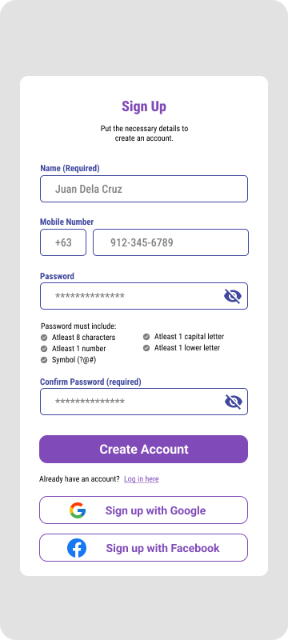

## Site Map

- ### Login and Signup

  * [Log in](LogIn.md)
  * [**Sign up**](#sign-up-page-mock-up)

- ### Main Page

  * [Homepage](Homepage.md)
  * [Reports](Reports.md)
  * [Store](Store.md)

- ### Storage

  - #### Inventory System

    * [Interface](Inventory.md)
    * [Add Inventory Item]()
    * [Delete Inventory Item]()
    * [Edit Inventory Item]()

  - #### Product Storage System

    * [Interface](Products.md)
    * [Add Product]()
    * [Delete Product]()
    * [Edit Product]()

- ### Point-Of-Sales System

  * [POS Interface](PointOfSales.md)
  * [Add POS Item]()
  * [Delete POS Item]()
  * [Edit POS Item]()

- ### Ledgers

  * #### Cash Ledger

    * [Interface](CashLedger.md)
    * [Add Cash Record]()
    * [Delete Cash Record]()
    * [Edit Cash Record]()

  * #### Credit Ledger

    * [Interface](CreditLedger.md)
    * [Add Credit Record]()
    * [Delete Credit Record]()
    * [Edit Credit Record]()
  
  * #### Payment Ledger

    * [Interface](PaymentLedger.md)
    * [Add Payment Record]()
    * [Delete Payment Record]()
    * [Edit Payment Record]()

---

## Sign Up Page Mock-Up

---

## Description
The **Sign Up Page** features a simple user-interface with added dynamic guide for password creation. The user may opt to create an account with third-party authenticators such as **Facebook** and **Google**.

### Input
* **Name** - The name of the user.
* **Mobile Number** - The mobile number of the user.
* **Password** - A unique password with guiding label.
* **Password Confirmation** - The exact replica of the chosen password to ensure accuracy during account creation.

### Process

* The system will perform a secure API call to the third-party application's authorization API.
* When successful, the system will generate a new account that corresponds to the user's data from the linked third-party authentication provider.

### Output

A new account for the user will be created. The user will be using the mobile number if the user opts to register through the default registration form, otherwise the user will be using the email address that they have used when the user opts to register through third-party authentications.

## Data Dictionary

| Element ID | Element Text | Element Type | Data Type | Required? | Rules |
|---|---|---|---|---|---|
|SignUpHeader|Sign Up|Header|Text|No|None|
|SignUpName|Name (Required)|Text|Text|Yes|None|
|SignUpMobileNumber|Mobile Number|Text|Text|Yes|None|
|SignUpPassword|Password|Password|Text|Yes|Masked|
|SignUpConfirmationPassword|Confirm Pass (Required)|Password|Text|Yes|Masked|
|SignUpCreateAccount|Create Account|Button|Component|No|None|
|SignUpLogin|Log in here|Link|Anchor|No|Hyperlink|
|SignUpWithGoogle|Sign up with Google|Button|Component|No|Hyperlink|
|SignUpWithFacebook|Sign up with Facebook|Button|Component|No|Hyperlink|