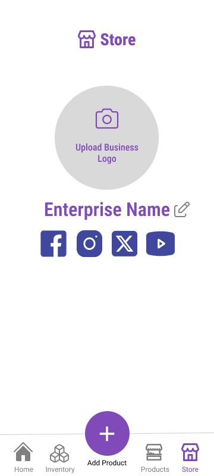

## Site Map

- ### Login and Signup

  * [Log in](LogIn.md)
  * [Sign up](SignUp.md)

- ### Main Page

  * [Homepage](Homepage.md)
  * [Reports](Reports.md)
  * [**Store**](#store-page-mock-up)

- ### Storage

  - #### Inventory System

    * [Interface](Inventory.md)
    * [Add Inventory Item]()
    * [Delete Inventory Item]()
    * [Edit Inventory Item]()

  - #### Product Storage System

    * [Interface](Products.md)
    * [Add Product]()
    * [Delete Product]()
    * [Edit Product]()

- ### Point-Of-Sales System

  * [POS Interface](PointOfSales.md)
  * [Add POS Item]()
  * [Delete POS Item]()
  * [Edit POS Item]()

- ### Ledgers

  * #### Cash Ledger

    * [Interface](CashLedger.md)
    * [Add Cash Record]()
    * [Delete Cash Record]()
    * [Edit Cash Record]()

  * #### Credit Ledger

    * [Interface](CreditLedger.md)
    * [Add Credit Record]()
    * [Delete Credit Record]()
    * [Edit Credit Record]()
  
  * #### Payment Ledger

    * [Interface](PaymentLedger.md)
    * [Add Payment Record]()
    * [Delete Payment Record]()
    * [Edit Payment Record]()

---

## Store Page Mock-Up

---

## Description
The **Store Page** of the application features a general overview of the proprietor's business information. The user may edit the information that is presented in this page.

### Input

* **Business Logo Image** - An image corresponding to the user's business logo.
* **Enterprise Name** - The name of the enterprise of the user.
* **Link Icons** - Social links that connects to the user's enterprise social accounts.

### Process

* The **business log** will be used as the main image for every time that the application will reference the image of the store.
* The **enterprise name** will be used by the application for every reference of the user's store.
* The **link icons** will allow the user to be redirected easily to their social accounts whenever clicked.

### Output

The store page will render the customized view of the user's information.

## Data Dictionary
| Element ID | Element Text | Element Type | Data Type | Required? | Rules |
|---|---|---|---|---|---|
|StoreHeader|Store|Text|Text|No|None|
|UploadIcon|Upload Business Logo|Button|Component|No|None|
|EnterpriseName|Enterprise Name|Text|Text|No|Editable|
|SocialLinkButtons|...|Button|Component|No|None|